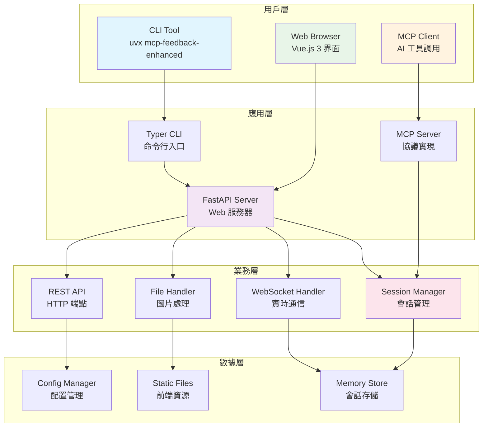

# 🎯 MCP Feedback Enhanced 開發計劃書

**專案名稱**：MCP Feedback Enhanced  
**技術棧**：Python (FastAPI) + Vue.js 3 + Vite + WebSocket  
**目標**：創建支援 uvx 一鍵使用的 MCP 反饋收集系統，發布到 PyPI  
**創建日期**：2025-06-07  
**預計完成**：2025-06-24  

---

## 🏗️ 核心組件架構



---

## 📁 專案目錄結構

```
mcp-feedback-enhanced/
├── pyproject.toml              # 專案配置，CLI 入口點
├── README.md                   # 專案說明
├── LICENSE                     # MIT 授權
├── CHANGELOG.md               # 版本記錄
├── src/
│   └── mcp_feedback_enhanced/
│       ├── __init__.py        # 包初始化，版本信息
│       ├── cli.py             # CLI 入口點（支援 uvx）
│       ├── backend/           # 後端服務目錄
│       │   ├── __init__.py
│       │   ├── main.py        # FastAPI 應用主入口
│       │   ├── mcp_server.py  # MCP 協議實現
│       │   ├── websocket.py   # WebSocket 處理
│       │   ├── session.py     # 會話管理
│       │   ├── models.py      # 數據模型
│       │   ├── config.py      # 配置管理
│       │   ├── file_handler.py # 文件處理
│       │   └── static.py      # 靜態文件服務
│       └── frontend/          # 前端資源目錄
│           ├── __init__.py
│           └── dist/          # 構建後的前端文件
├── frontend-dev/              # 前端開發目錄
│   ├── package.json
│   ├── vite.config.js
│   ├── src/
│   │   ├── main.js
│   │   ├── App.vue
│   │   ├── components/        # Vue 組件
│   │   ├── composables/       # Composition API
│   │   ├── stores/           # Pinia 狀態管理
│   │   └── assets/           # 樣式和資源
│   └── public/
├── tests/                     # 測試文件
│   ├── test_backend/
│   ├── test_frontend/
│   └── test_integration/
├── docs/                      # 文檔
│   ├── api.md
│   ├── development.md
│   └── deployment.md
└── scripts/                   # 構建腳本
    ├── build_frontend.py
    └── package_release.py
```

---

## 🎯 技術棧詳細規格

### 後端技術棧
- **Python**: >=3.11
- **FastAPI**: >=0.104.0 (Web 框架)
- **Uvicorn**: >=0.24.0 (ASGI 服務器)
- **WebSockets**: >=12.0 (實時通信)
- **Pydantic**: >=2.5.0 (數據驗證)
- **Typer**: >=0.9.0 (CLI 框架)
- **Pillow**: >=10.1.0 (圖片處理)
- **MCP**: >=1.9.3 (MCP 協議)

### 前端技術棧
- **Vue.js**: ^3.4.0 (UI 框架)
- **Vite**: ^5.0.0 (構建工具)
- **Pinia**: ^2.1.0 (狀態管理)
- **Axios**: ^1.6.0 (HTTP 客戶端)
- **SCSS**: ^1.69.0 (樣式預處理)

---

## 📋 任務追蹤表

### 🔵 階段一：專案結構建立與基礎配置 (1-2 天)

| 任務 | 負責人 | 狀態 | 預計時間 | 實際時間 | 備註 |
|------|--------|------|----------|----------|------|
| 1.1 建立專案目錄結構 | Dev | ⏳ 待開始 | 2h | - | 創建完整目錄骨架 |
| 1.2 配置 pyproject.toml | Dev | ⏳ 待開始 | 3h | - | CLI 入口點、依賴配置 |
| 1.3 建立前端開發環境 | Dev | ⏳ 待開始 | 2h | - | Vue.js + Vite 初始化 |
| 1.4 基礎文檔撰寫 | Dev | ⏳ 待開始 | 1h | - | README、LICENSE |

**階段目標**：✅ 專案結構完整，前後端環境可啟動

### 🔵 階段二：後端核心功能實作 (3-4 天)

| 任務 | 負責人 | 狀態 | 預計時間 | 實際時間 | 備註 |
|------|--------|------|----------|----------|------|
| 2.1 配置管理系統 | Dev | ⏳ 待開始 | 2h | - | Pydantic Settings |
| 2.2 數據模型定義 | Dev | ⏳ 待開始 | 3h | - | Session、Feedback、Image 模型 |
| 2.3 會話管理系統 | Dev | ⏳ 待開始 | 4h | - | 生命週期、ID 生成、清理 |
| 2.4 MCP 服務器實作 | Dev | ⏳ 待開始 | 6h | - | collect_feedback 工具 |
| 2.5 WebSocket 處理系統 | Dev | ⏳ 待開始 | 5h | - | 實時通信、事件處理 |
| 2.6 文件處理系統 | Dev | ⏳ 待開始 | 4h | - | 圖片上傳、驗證、處理 |
| 2.7 FastAPI 主應用 | Dev | ⏳ 待開始 | 4h | - | 路由、中間件、生命週期 |

**階段目標**：✅ API 端點正常，MCP 工具可用，WebSocket 通信正常

### 🔵 階段三：前端界面開發 (3-4 天)

| 任務 | 負責人 | 狀態 | 預計時間 | 實際時間 | 備註 |
|------|--------|------|----------|----------|------|
| 3.1 狀態管理系統 | Dev | ⏳ 待開始 | 3h | - | Pinia stores |
| 3.2 WebSocket 客戶端 | Dev | ⏳ 待開始 | 4h | - | 連接管理、事件處理 |
| 3.3 會話狀態組件 | Dev | ⏳ 待開始 | 2h | - | 狀態指示器 |
| 3.4 反饋表單組件 | Dev | ⏳ 待開始 | 4h | - | 文本輸入、驗證 |
| 3.5 圖片上傳組件 | Dev | ⏳ 待開始 | 5h | - | 拖拽上傳、預覽 |
| 3.6 主應用組件 | Dev | ⏳ 待開始 | 3h | - | 布局、路由 |
| 3.7 樣式和主題 | Dev | ⏳ 待開始 | 3h | - | SCSS、響應式設計 |

**階段目標**：✅ 用戶界面完整，交互流暢，響應式設計

### 🔵 階段四：系統集成與 CLI 開發 (1-2 天)

| 任務 | 負責人 | 狀態 | 預計時間 | 實際時間 | 備註 |
|------|--------|------|----------|----------|------|
| 4.1 CLI 入口點實作 | Dev | ⏳ 待開始 | 3h | - | Typer 命令行工具 |
| 4.2 前端構建腳本 | Dev | ⏳ 待開始 | 2h | - | 自動化構建流程 |
| 4.3 靜態文件服務 | Dev | ⏳ 待開始 | 2h | - | SPA 路由支援 |
| 4.4 包初始化文件 | Dev | ⏳ 待開始 | 1h | - | 版本管理、元數據 |

**階段目標**：✅ 前後端集成，CLI 工具可用，uvx 兼容

### 🔵 階段五：測試與質量保證 (2-3 天)

| 任務 | 負責人 | 狀態 | 預計時間 | 實際時間 | 備註 |
|------|--------|------|----------|----------|------|
| 5.1 後端單元測試 | Dev | ⏳ 待開始 | 6h | - | pytest, 90% 覆蓋率 |
| 5.2 前端單元測試 | Dev | ⏳ 待開始 | 4h | - | Vitest, Vue Test Utils |
| 5.3 集成測試 | Dev | ⏳ 待開始 | 4h | - | 端到端功能驗證 |
| 5.4 性能測試 | Dev | ⏳ 待開始 | 2h | - | 負載測試、性能基準 |

**階段目標**：✅ 測試通過，質量達標，性能符合要求

### 🔵 階段六：打包與發布 (1-2 天)

| 任務 | 負責人 | 狀態 | 預計時間 | 實際時間 | 備註 |
|------|--------|------|----------|----------|------|
| 6.1 構建流程優化 | Dev | ⏳ 待開始 | 2h | - | 自動化發布腳本 |
| 6.2 文檔撰寫 | Dev | ⏳ 待開始 | 4h | - | API 文檔、使用指南 |
| 6.3 PyPI 發布準備 | Dev | ⏳ 待開始 | 2h | - | 包構建、版本檢查 |
| 6.4 uvx 兼容性測試 | Dev | ⏳ 待開始 | 1h | - | 一鍵使用驗證 |

**階段目標**：✅ PyPI 發布成功，uvx 一鍵使用正常

---

## 🎯 成功標準

### 功能性要求
- ✅ **MCP 協議兼容**：完整實現 `collect_feedback` 工具
- ✅ **實時通信**：WebSocket 雙向通信穩定
- ✅ **文件處理**：支援圖片上傳、預覽、格式轉換
- ✅ **會話管理**：自動生命週期管理、超時清理
- ✅ **用戶界面**：響應式設計、直觀易用

### 技術性要求
- ✅ **uvx 兼容**：支援 `uvx mcp-feedback-enhanced` 一鍵使用
- ✅ **PyPI 發布**：符合 Python 包發布標準
- ✅ **測試覆蓋**：後端 90% 以上，前端核心功能覆蓋
- ✅ **性能標準**：支援 100 並發會話，響應時間 < 200ms
- ✅ **安全性**：文件上傳驗證、XSS 防護、CORS 配置

### 用戶體驗要求
- ✅ **安裝簡單**：一條命令安裝使用
- ✅ **界面友好**：現代化設計、操作直觀
- ✅ **錯誤處理**：友好的錯誤提示和恢復機制
- ✅ **文檔完整**：安裝、使用、開發文檔齊全

---

## 📊 風險評估與應對

| 風險項目 | 風險等級 | 影響 | 應對策略 |
|----------|----------|------|----------|
| MCP 協議兼容性問題 | 🔴 高 | 核心功能無法使用 | 深入研究 MCP 文檔，參考現有實現 |
| WebSocket 連接穩定性 | 🟡 中 | 實時通信中斷 | 實現重連機制，錯誤處理 |
| 前端構建集成複雜 | 🟡 中 | 打包發布困難 | 簡化構建流程，自動化腳本 |
| uvx 兼容性問題 | 🟡 中 | 一鍵使用失效 | 測試多種環境，參考最佳實踐 |
| 性能不達標 | 🟢 低 | 用戶體驗下降 | 性能測試，代碼優化 |

---

## 📝 備註

- **開發環境**：Python 3.11+, Node.js 18+, Git
- **測試環境**：多 Python 版本、多操作系統
- **發布流程**：GitHub Actions CI/CD（可選）
- **版本管理**：語義化版本控制 (SemVer)
- **授權協議**：MIT License

---

**最後更新**：2025-06-07  
**下次審查**：階段一完成後
